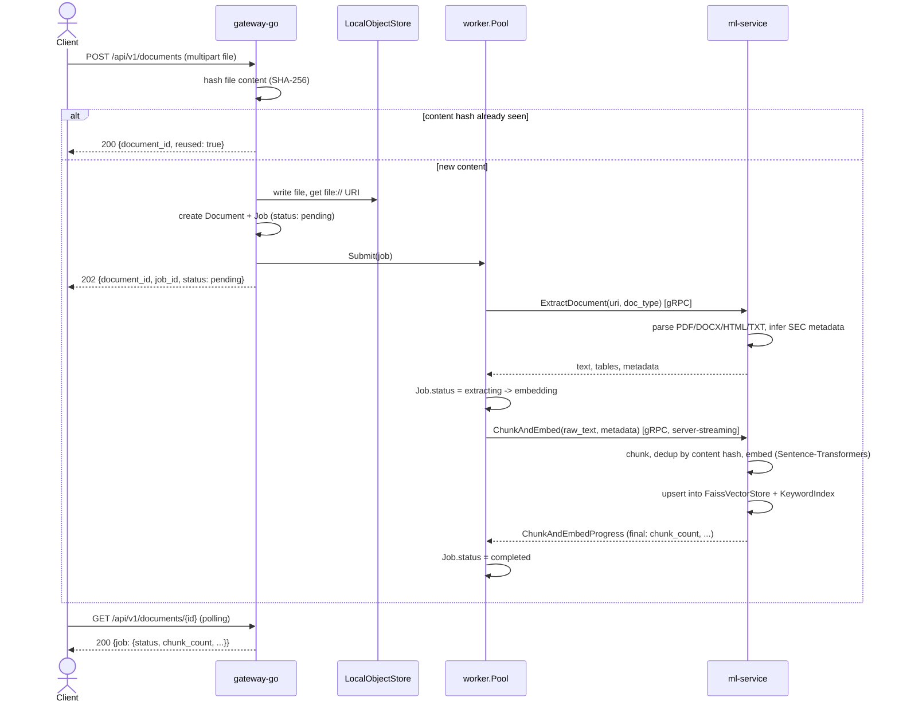
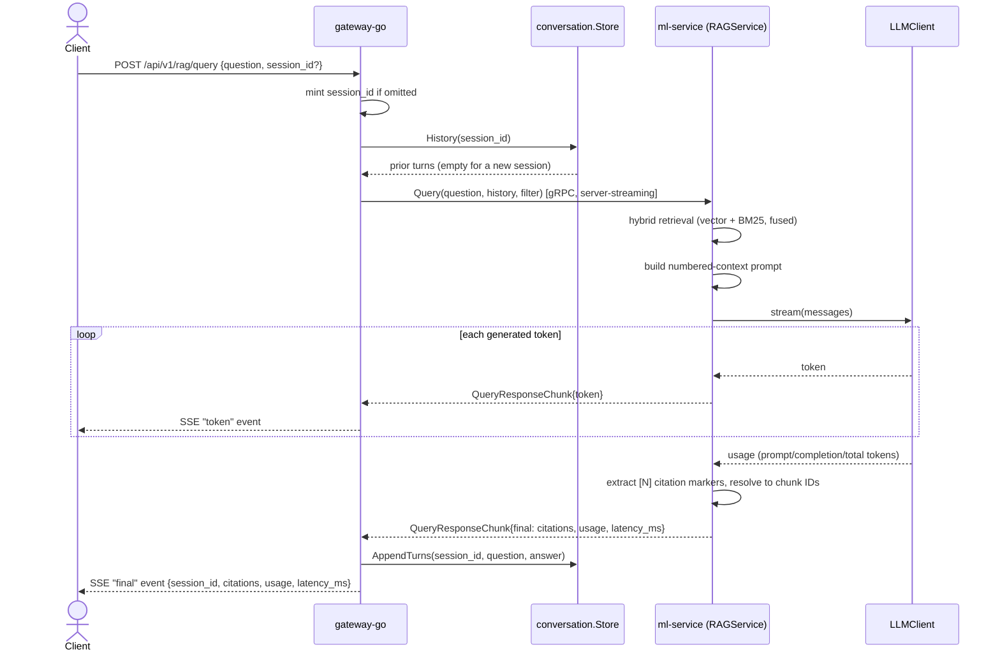
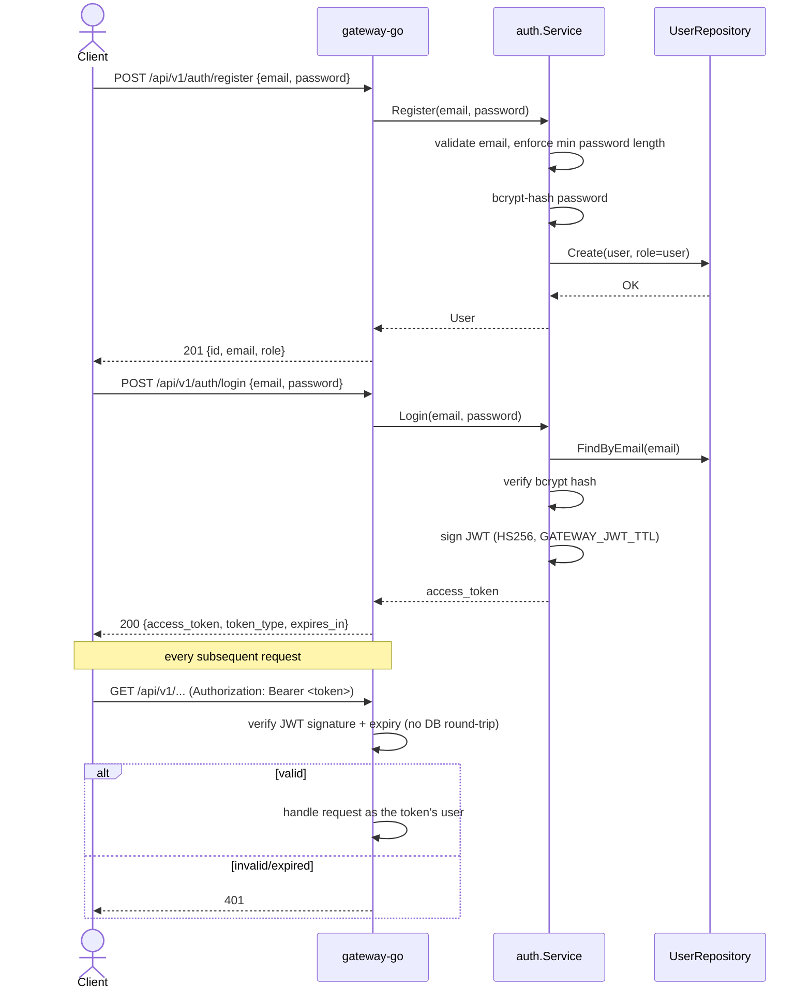

# Sequence diagrams

Companion to [`ARCHITECTURE.md`](ARCHITECTURE.md)'s static service-boundary
diagram — these show the three flows that actually exercise every layer of
the system end-to-end, each verified against real running processes (not
just diagrammed from reading the code — see the relevant phase's commit
message in `git log` for what was actually run).

## 1. Document upload and ingestion

Async by design: the HTTP request returns as soon as the file is durably
stored and a job is queued, not once processing finishes — a client polls
`GET /api/v1/documents/{id}` for status (see `gateway-go/README.md`'s
"A bounded worker pool is the actual 'concurrent ingestion' story").

## 2. RAG query — streamed, cited, and remembered

The reason the gateway-go <-> ml-service boundary supports streaming at
all (see `proto/README.md`'s "Why these RPC shapes"): a token appears on
the client the moment ml-service generates it, not after the whole answer
is done.

## 3. Auth: register, login, and every authenticated request after

Stateless JWTs — no session lookup on the hot path, at the cost of no
instant revocation before a token's (short) TTL expires (see
`gateway-go/README.md`'s design decisions for why that tradeoff was made
deliberately).

